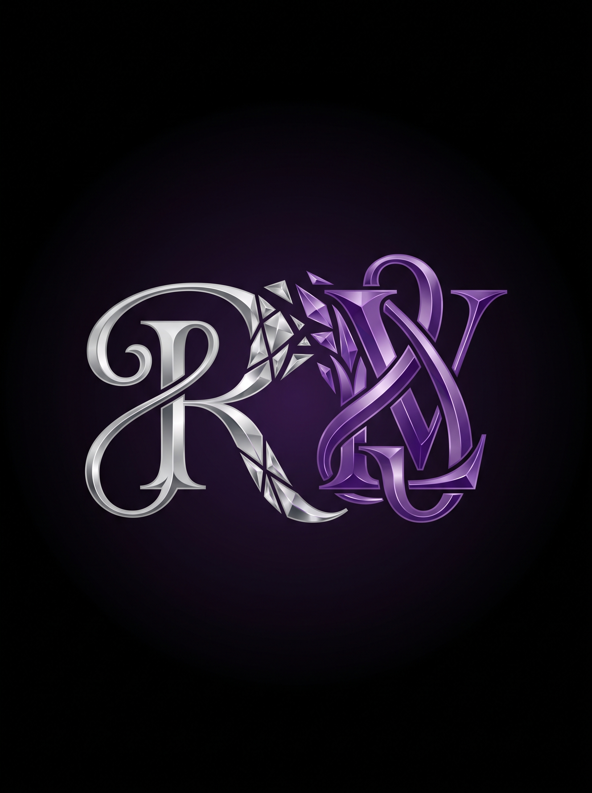
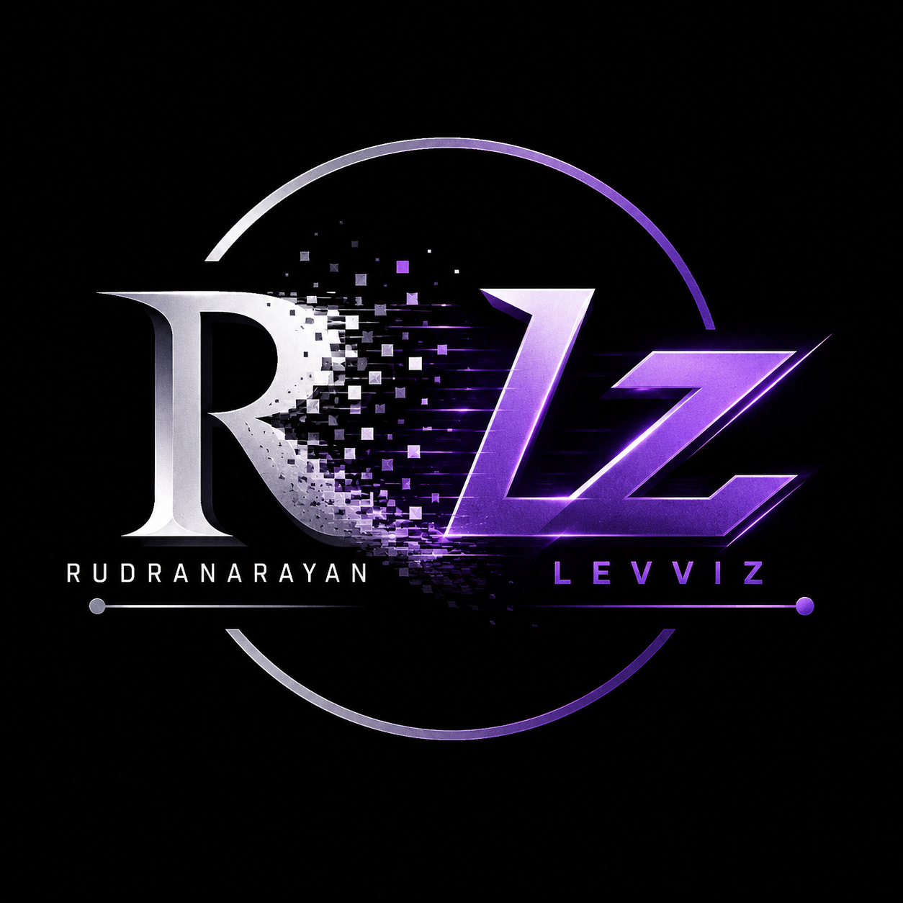

<div align="center">

<a href="https://website-leevee-os.vercel.app/"></a>

<video src="purple.mp4" autoplay loop muted width="100%"></video>



<br/>


[](https://website-leevee-os.vercel.app/)


</div>

---


**Student engineer exploring AI, systems, and intelligent design.**

I like building things that **hold up under real conditions** — not just ideas that look impressive once.
Most of my work focuses on understanding how systems behave, where they fail, and how to design them better.

Python is my primary language — it's where most of my thinking happens.
I use it to experiment with AI concepts, prototype ideas, and build systems that value **clarity and reliability**.
When ideas need a visible form, I work with **HTML, CSS, and JavaScript**.

> I prefer learning by doing: building, breaking, fixing, and refining.
> Iteration matters more to me than perfection.

<br clear="right"/>

---

## ⚙️ What I Work With

<div align="center">


</div>

```python
rudra = {
    "languages"  : ["Python", "HTML", "CSS", "JavaScript"],
    "focus"      : ["AI / ML fundamentals", "System-oriented problem solving"],
    "approach"   : "Build → Break → Fix → Refine",
    "philosophy" : "Understand *why* it works, not just that it works"
}
```

---

## 🔨 What I Like Building

<div align="center">

| | Focus | Why it matters |
|---|---|---|
| 🤖 | **Intelligent systems** | Solve real constraints, not just demo well |
| ⚡ | **Optimization tools** | Optimize processes, don't just predict outcomes |
| 🏗️ | **Structure-first projects** | Logic and architecture over hype |

</div>

---

## 🏆 Achievements

<div align="center">

| 🥇 | Winner — **Atherion 22K25 Hackathon** |
|---|---|
| 🎯 | **Founding Coordinator** of a National-Level Tech Fest |
| 🔗 | Built a **supply chain optimization system** for automated analysis and decision-making |

</div>

---

## 📊 GitHub Stats

<div align="center">


<br/><br/>


</div>

---

## 🎯 How I Approach Technology

I don't see AI as magic or shortcuts.
To me, it's a tool — **useful only when it's grounded in logic, constraints, and real-world behavior.**

I enjoy working on problems where:
- **trade-offs matter**
- **assumptions are tested**
- **solutions need to adapt, not just respond**

---

<div align="center">
  
  <br/>
  <i>Learning is ongoing. This GitHub is a record of that process.</i>
</div>
