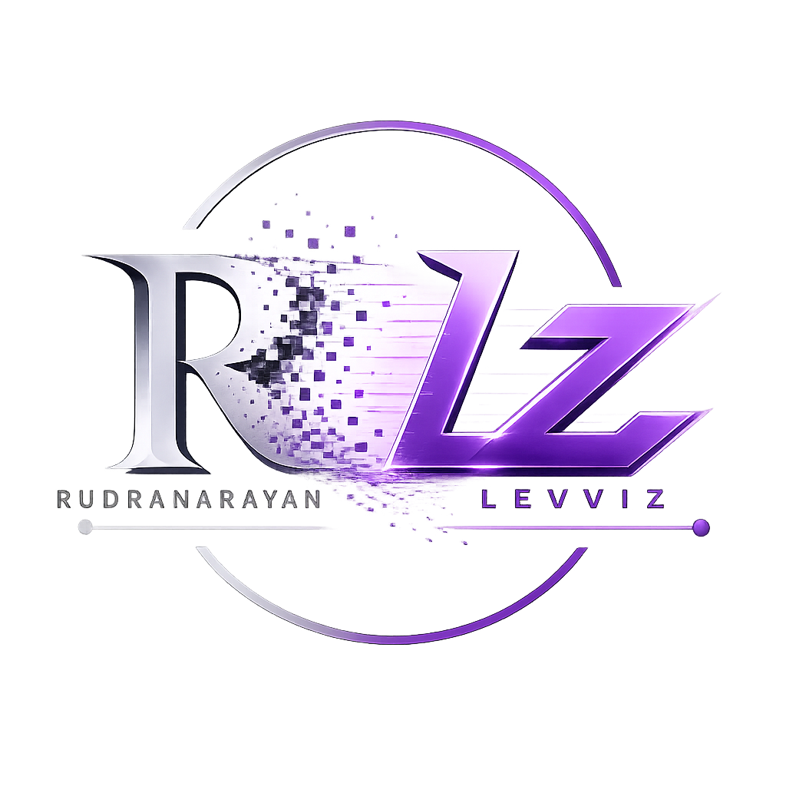

<!-- ╔═══════════════════════════════════════════════════════════════╗
     ║                    RUDRA  —  STUDENT ENGINEER                  ║
     ╚═══════════════════════════════════════════════════════════════╝ -->

<!-- ═══════ ANIMATED HEADER BANNER ═══════ -->

 

<!-- ═══════ STATUS & BADGES ROW ═══════ -->

  
  &nbsp;
  
  &nbsp;
  
  &nbsp;
  

 

<!-- ═══════ TYPING ANIMATION ═══════ -->

  

<!-- ═══════ DYNAMIC MEDIA ═══════ -->
<video src="https://github.com/Leviiiz18/Leviiiz18/raw/main/purple.mp4" autoplay loop muted playsinline width="100%"></video>
  

  

<!-- ═══════ NEON DIVIDER ═══════ -->

 

<!-- ═══════ ABOUT SECTION ═══════ -->
<table>
<tr>
<td width="58%" valign="top">

### 🚀 About Me

Student engineer exploring **AI, systems, and intelligent design**.

I like building things that **hold up under real conditions** — not just ideas that look impressive once. Most of my work focuses on understanding how systems behave, where they fail, and how to design them better.

**Python** is my primary language — it's where most of my thinking happens. I use it to experiment with AI concepts, prototype ideas, and build systems that value **clarity and reliability**. When ideas need a visible form, I work with **HTML, CSS, and JavaScript**.

> *"I prefer learning by doing: building, breaking, fixing, and refining. Iteration matters more to me than perfection."*

</td>
<td width="42%" valign="top" align="center">

<!-- ═══════ GITHUB STATS CARD ═══════ -->

  

<!-- ═══════ STREAK STATS ═══════ -->

</td>
</tr>
</table>

 

<!-- ═══════ NEON DIVIDER ═══════ -->

  

 

<!-- ═══════ TECH STACK ═══════ -->

## ⚡ Tech Stack

  

 

<!-- ═══════ CODE BLOCK ═══════ -->

 

<!-- ═══════ NEON DIVIDER ═══════ -->

  

 

<!-- ═══════ WHAT I BUILD ═══════ -->

## 🔨 What I Build

<table>
<tr>
<td align="center" width="33%">

### 🤖
**Intelligent Systems**

*Solve real constraints,*
*not just demo well*

</td>
<td align="center" width="33%">

### ⚡
**Optimization Tools**

*Optimize processes,*
*don't just predict*

</td>
<td align="center" width="33%">

### 🏗️
**Structure-First**

*Logic and architecture*
*over hype*

</td>
</tr>
</table>

 

<!-- ═══════ NEON DIVIDER ═══════ -->

  

 

<!-- ═══════ ACHIEVEMENTS ═══════ -->

## 🏆 Achievements

  

  

  

 

<!-- ═══════ NEON DIVIDER ═══════ -->

  

 

<!-- ═══════ GITHUB STATS ROW ═══════ -->

## 📊 GitHub Stats

  
  &nbsp;&nbsp;
  

 

<!-- ═══════ CONTRIBUTION GRAPH ═══════ -->

 

<!-- ═══════ NEON DIVIDER ═══════ -->

  

 

<!-- ═══════ PHILOSOPHY ═══════ -->

## 🎯 Philosophy

  

  

 

  
  &nbsp;
  
  &nbsp;
  

 

<!-- ═══════ FOOTER ═══════ -->

 

  
  &nbsp;
  

**Built with passion, caffeine, and a lot of iteration.** ☕

